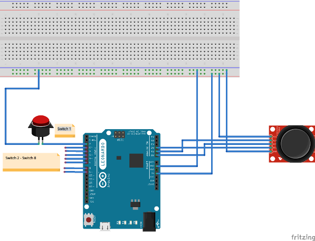

# USBSwitch

###### USB switch is a device which lets you connect multiple momentary switches (8) to a computer through USB interface, and map each switch to a character or set of characters which are sent the computer as keyboard press, these switches are mapped by default to digits "1" to "8", they can be remapped through a configuration program through the computer and assign a character or a set of charaters to each switch dynamically. 

````
Switch 1 - "1"
Switch 2 - "2"
Switch 3 - "3"
Switch 4 - "4"
Switch 5 - "5"
Switch 6 - "6"
Switch 7 - "7"
Switch 8 - "8"

````

## Circuit Diagram 	


## Connections 
###### The sketch intializes the Keyboard, Mouse and Serial interface, 

## JoyStick 
###### joystick is connected to A0, A1, A2 pin of the arduino leanardo, the A0 pin is connected to X-axis, A1 is connected to Y axis and A2 is connected to mouse press, the vcc pin to 5V and GND to GND.  


## Switches
###### 8 switches are conneted to digital pins of the arduino leanardo from D2 to D9, the PINS are connected to GND through the switch. 

## Serial Port 
###### Serial port is used for accepting commands from the computer, the following commands are supported now 

`````

M:1 (enable joystick interface to mouse)
M:0 (disable joystick interface to mouse)

P:<pin>:<mapping>  (map pin <pin> to set of keyboard characters <mapping>)

example 

P:2:Hello World (Switch 1 is mapped to "Hello world", when switch 1 is pressed the word "Hello world" will be sent to the computer through keyboard interface)

`````

##### The serial port is used to accept commands from the host computer through 


#### Video Demo 

[link](https://www.youtube.com/watch?v=txd9frRdaXE)
